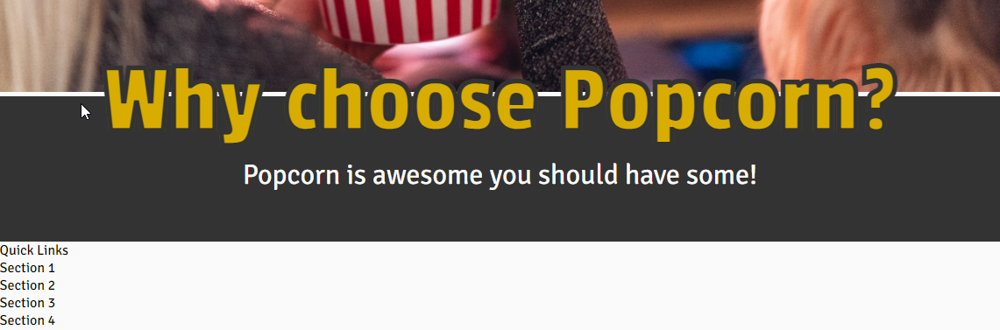
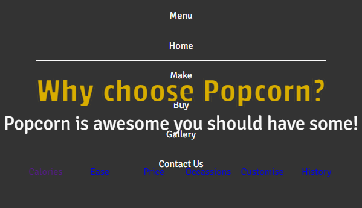
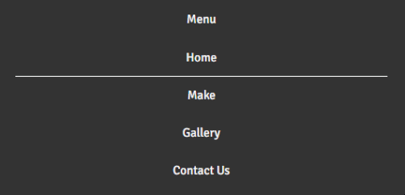

# Why Choose Popcorn?

Here I will document the creation of Why Choose Popcorn website.

## Wireframe

## Bugs

**Bug:** A white line appeared between the hero image and the block for the header.\
**Solution:** Incase the header and hero image in a div and add *style="font-size: 0;"* as an attribute to the div.

**Bug:** Other elements apeparing on top of collasible menu.\
**Solution:** Add *z-index:99;* to .menus class to make sure menus are always on top.

---

## Credits

### Code

https://www.30secondsofcode.org/css/s/hover-underline-animation \
I have modified this code as the original has the line come from bottom left and go of to bottom right. I preferred the line to go back to the bottom left, as this looked better when going between the different links in the nav bar.

### Images

- [yousafbhutta](https://pixabay.com/users/yousafbhutta-2933897/)
- [Los Muertos Crew](https://www.pexels.com/@cristian-rojas/)
- [Elsa Olofsson](https://www.pexels.com/@elsa-olofsson-3357043/)
- [Ron Lach](https://www.pexels.com/@ron-lach/)
- [Mikhail Nilov](https://www.pexels.com/@mikhail-nilov/)
- [Monstera](https://www.pexels.com/@gabby-k/)