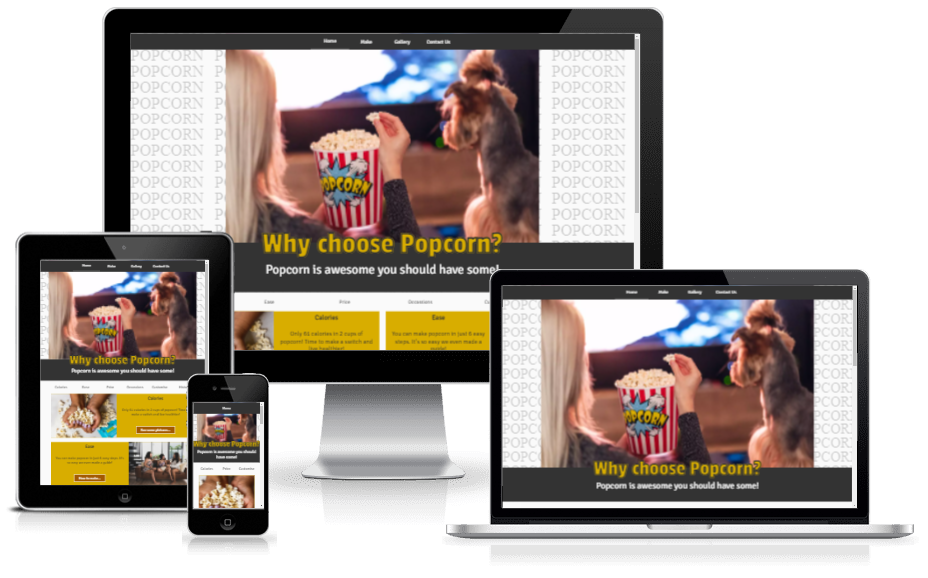
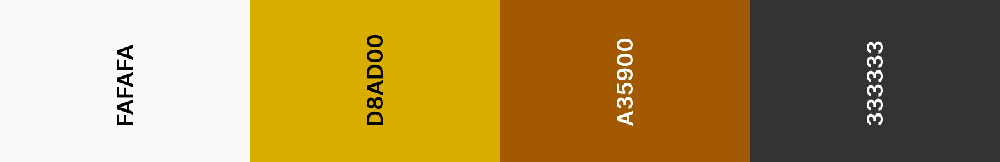
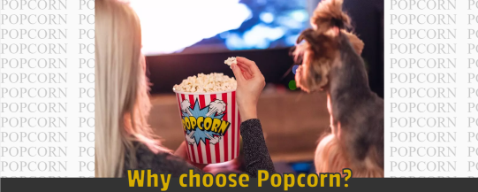
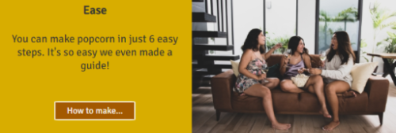
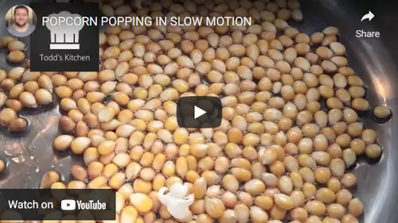
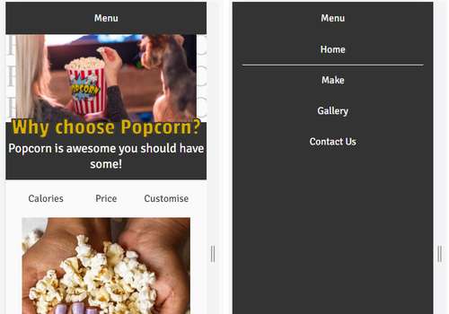
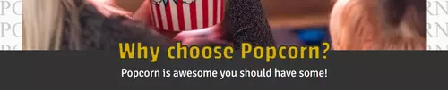

# **Portfolio Project 1 - HTML/CSS Essentials**

## **Live Site**
Why choose Popcorn? - [https://bobwritescode.github.io/ci-Project1](https://bobwritescode.github.io/ci-Project1)
## **Repository**
[https://github.com/daveyjh/ci-portfolio-one-v4](https://github.com/BobWritesCode/ci-Project1)
***
## **Table of Contents**
- [Objective](#Objective)
- [Brief](#Brief)
- [UX &#8722; User Experience Design](#UX-&#8722;-User-Experience-Design)
- [Initial Concept](#Initial-Concept)
    - [Wireframes](#Wireframes)
    - [Colour Scheme](#Colour-Scheme)
    - [Typography](#Typography)
    - [Imagery](#Imagery)
- [Features](#Features)
    - [Existing Features](#Existing-Features)
    - [Features Left to Implement](#Features-Left-to-Implement)
- [Technologies Used](#Technologies-Used)
- [Testing](#Testing)
- [Bugs](#Bugs)
    - [Current](#Current)
    - [Resolved](#Resolved)
- [Deployment](#Deployment)
- [Credits](#Credits)
    - [Content](#Content)
    - [Media](#Media)
    - [Acknowledgements](#Acknowledgements)
- [Personal Development](#Personal-Development)
***
## **Objective**
In this project I intent to create a website that provides some basic information on why people should choose popcorn and how to make popcorn.

The main objective is to demonstrate competency in HTML and CSS.  There are some small sections with other languages such as JavaScipt but this is purely included to enhance the user experience.

The website is designed to be responsive between different devices and the use of the site to be intuative by any user.

**The needs within this project are not genuine and are made purely for the purpose of completing my Code Institute project**
***
## **Brief**
The goal of this website is to provide the end user basic information to why they should choose popcorn as a snack.  
My goals for the site are to have:
- a eye catching front page with short sentences to engage the user.
- a receipe page to help users make their own popcorn.
- a gallerry show casing popcorn aswell as a YouTube video.
- a contact form, where a user can submit information.
- a uniform approach so all pages other then the homepage have a familar look and style.
***
## **UX &#8722; User Experience Design**
### **User Requirements**
Some example user stories which will affect the design:
- *"As a first time visitor, I want to know what this site is about. I may use a number of different devices (mobile/tablet etc.) to view the site. I would like to be able to navigate easily"*
- *"As a returning visitor, I want to be able to navigate to the page I want without getting lost"*
- *"As a unexperienced popcorn maker, I want to be able to follow instructions to making popcorn and have a way so I don't get lost where I am in the process."*
***
## **Initial Concept**
I hope to be able to deliver a website that does not overload the user with too many distractions (i.e. like out of place imagery, distracting backgrounds). The site needs to be easy to navigate for the user. 
A key focus is to deliver a high level experience for mobile, tablet and PC users.

### **Wireframes**


### **Colour Scheme**
\
A simple and refined colour scheme has been used.\
The white provides a nice canvas and is slightly off white to be easier on the user's eyes and blend better with the other colours.\
The yellow / gold is to symoblise happiness and is a strong bold colour to draw the eye of the user into the page.\
The dark grey colour provides a strong contract for text. It also works very well for the nav bar and footer to help frame the pages of the site.

### **Typography**
I have used several Google fonts to provide the site some unique character.\
The main site header uses Passion One. This was choosen as a clean easy to read font with a little bit of character. It also allowed me to add a strong outline to the wording.\
The main heading of all other pages use Exo and are all uppercased. It's a nice clean, easy to read, modern font.\
The bulk text of the website uses Signika Negative which is a clean, easy to read font at all sizes.\
Passion One falls back on to cursive and other fonts fall back on sans-serif if there is an issue loading the Google font.

### **Imagery**
Imagery is a very important feature of the website, as the website needs to appeal visually to engage users and represent the Why Choose Popcorn in a good light.\
All images choosen were purposly choosen to make sure the popcorn theme carried through the whole site.

#### **Hero Image**
\
The reason for picking the hero image was because of the vibrant imagery of popcorn in the centre of the picture. And the brighton but not overpowering colours in the rest of the image. 
Becuase I didn't want to have tooo much white space, I used SVG as a background to repeate the word POPCORN.

#### **Section images**
\
These images were choosen to show enjoyment. They were all framed 16:9 to be uniformed and to work better together when scaling for different screen sizes.

***
## **Features**
### **Existing Features**
- Responsive on all device sizes.
- By using mobile first design I have created a website that is fully responsive on all screen sizes.
- I have used the CSS Flex classes to adjust the layout based on the device screen size. This allows the images and texts to look good and be easy to read.

 
- On the gallery page there is YouTube video that the user can play and pause.
Interactive elements

#### **Nav Bar / Menu**
\
 

- The Nav bar is sticky to the top of the page, so as you scroll down it stays at the top of the screen.
- As you move the cursor over the choices there is animated line to highlight the option you are about to select.
- On a smaller screen the bar becomes collapsable and by tapping/click on menu it opens the menu as fullscreen.

 
- I have position the header text to slightly overlay the hero image, to try and provide a path to direct the user to scroll down.

### **Features Left to Implement**

#### **E-Commerce**
- There could be section of the site to purchase popcorn online.
#### **Blog**
- This would allow me to provide a way for the site owner to provide regular updates straight to site visitors.

***
## **Technologies Used**

### **Languages Used**
- [HTML](https://en.wikipedia.org/wiki/HTML5)
- [CSS3](https://en.wikipedia.org/wiki/CSS)
- [JavaScript](https://www.javascript.com/) - Used to process the data submitted on the contact form to show on the next page.

***

## **Bugs**

\
**Bug:** A white line appeared between the hero image and the block for the header.\
**Solution:** Incase the header and hero image in a div and add *style="font-size: 0;"* as an attribute to the div.

\
**Bug:** Other elements apeparing on top of collasible menu.\
**Solution:** Add *z-index:99;* to .menus class to make sure menus are always on top.

***
## Deployment

### GitHub Pages

The project was deployed to GitHub Pages using these steps:

1. Log in to GitHub and go to the [GitHub Repository](https://github.com/BobWritesCode/ci-Project1)
2. Locate the Navbar at the top of the Repository (not top of page). Click the Settings tab.
3. Locate the Navbar on the left hand side of the page. Click the "Pages" section (under 'Code and automation').
4. Under "Source", click the dropdown called "None" and select "main". Click save.
5. The page will automatically refresh.
6. A notification will appear at the top of the page with the [link](https://bobwritescode.github.io/ci-Project1/) to the deployed site. You can return to this GitHub Pages section to access the link.

### Forking the GitHub Repository

Forks are used to propose changes to someone else's project or to use someone else's project as a starting point for your own idea. By forking the GitHub Repository you make a copy of the original repository on our GitHub account to view and/or make changes without affecting the original repository.

To Fork a Github Repository:

1. Log in to GitHub and go to the [GitHub Repository](https://github.com/BobWritesCode/ci-Project1)
2. Locate the Fork button in the top-right corner of the page, click Fork.
3. You should now have a copy of the original repository in your GitHub account.

### Making a Local Clone

You will now have a fork of the repository, but you don't have the files in that repository locally on your computer.

To make a local clone:

1. Log in to GitHub and go to the [GitHub Repository](https://github.com/BobWritesCode/ci-Project1)
2. Above the list of files, click  Code.
3. To clone the repository using HTTPS, under "Clone with HTTPS", click the 'Copy' icon. To clone the repository using an SSH key, including a certificate issued by your organization's SSH certificate authority, click Use SSH, then click the 'Copy' icon. To clone a repository using GitHub CLI, click Use GitHub CLI, then click the 'Copy' icon.
4. Open Git Bash.
5. Change the current working directory to the location where you want the cloned directory.
6. Type git clone, and then paste the URL you copied earlier. It will look like this, with your GitHub AE username instead of YOUR-USERNAME:

```
$ git clone https://github.com/YOUR-USERNAME/YOUR-REPOSITORY
```

7. Press Enter. Your local clone will be created.

```
$ git clone https://github.com/YOUR-USERNAME/YOUR-REPOSITORY
> Cloning into `milestone-project-one`...
> remote: Counting objects: 10, done.
> remote: Compressing objects: 100% (8/8), done.
> remove: Total 10 (delta 1), reused 10 (delta 1)
> Unpacking objects: 100% (10/10), done.
```

Click [Here](https://docs.github.com/en/github-ae@latest/get-started/quickstart/fork-a-repo) for the GitHub quick start guide with images and more detailed explanations of the above process.

***
## Credits

### Code

 \
 \
https://www.30secondsofcode.org/css/s/hover-underline-animation \
I have modified this code as the original has the line come from bottom left and go of to bottom right. I preferred the line to go back to the bottom left, as this looked better when going between the different links in the nav bar.

### Images

- [Pexels](https://www.pexels.com/)
- [Image optimising](http://www.imageoptimizer.net/Home.aspx)
- [yousafbhutta](https://pixabay.com/users/yousafbhutta-2933897/)
- [Los Muertos Crew](https://www.pexels.com/@cristian-rojas/)
- [Elsa Olofsson](https://www.pexels.com/@elsa-olofsson-3357043/)
- [Ron Lach](https://www.pexels.com/@ron-lach/)
- [Mikhail Nilov](https://www.pexels.com/@mikhail-nilov/)
- [Monstera](https://www.pexels.com/@gabby-k/)
- [Anna Pyshniuk](https://www.pexels.com/@anna-pyshniuk-2453945/)