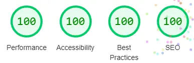
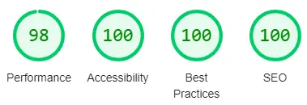
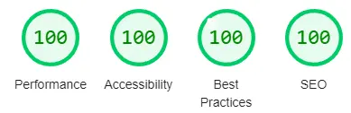
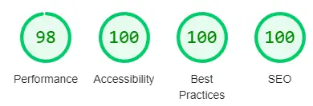
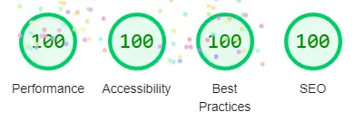
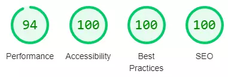
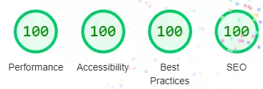

# **Testing**

## Introduction

To make sure my site is running as expected I will be using different tools to measure the performance.

- On every page I will run Lighthouse for PC and mobile version of the sites.
- Every page will have the html check in the [W3C validator](https://validator.w3.org/)
- The CSS stylesheet will be checked in the [W3C validator](https://jigsaw.w3.org/css-validator/)

***
## CSS Stylesheet

The CSS stylesheet passed with no errors found.

***
## Homepage (index.html)
[Homepage - index.html](https://bobwritescode.github.io/ci-Project1/index.html)

### W3C html validator
- No errors or warnings to show.

### PC

### Mobile

***
## How To Make Popcorn (make.html)
[How To Make Popcorn - make.html](https://bobwritescode.github.io/ci-Project1/make.html)

### PC

### Mobile

***
## Gallery (gallery.html)
[Gallery - gallery.html](https://bobwritescode.github.io/ci-Project1/gallery.html)

### W3C html validator
- No errors or warnings to show.

### PC

### Mobile

***
## Contact Us (contact.html)
[Contact Us - contact.html](https://bobwritescode.github.io/ci-Project1/contact.html)

### PC

### Mobile

***
## 404 (404.html)
[404 - 404.html](https://bobwritescode.github.io/ci-Project1/404.html)

### PC

### Mobile
