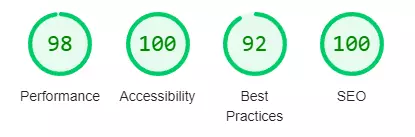

# **Testing**

## Introduction

To make sure my site is running as expected I will be using different tools to measure the performance.

- On every page I will run Lighthouse for PC and mobile version of the sites.
- Every page will have the html check in the [W3C validator](https://validator.w3.org/)
- The CSS stylesheet will be checked in the [W3C validator](https://jigsaw.w3.org/css-validator/)

***
## Browser testing

- **Chrome** - This is the site I have done the most extensive testing on as it has been the site, I have used primarily to build the website, and perform the extensive testing detailed below.
- **Firefox** - 1 error was identified on the contact form. The text area box had too many rows and caused it to overflow. I set the text area to 2 rows and the problem was solved.
- **Microsoft Edge** - No errors identified.
- **Opera** - No errors identified.
- **Android (Mobile)** - No errors identified.

***
## CSS Stylesheet

The CSS stylesheet passed with no errors found.

***
## Homepage (index.html)
[Homepage - index.html](https://bobwritescode.github.io/ci-Project1/index.html)

### W3C html validator
- No errors or warnings to show.

### PC

### Mobile

### WCAG Colour contrast checker

***
## How To Make Popcorn (make.html)
[How To Make Popcorn - make.html](https://bobwritescode.github.io/ci-Project1/make.html)

### PC

### Mobile

### WCAG Colour contrast checker

***
## Gallery (gallery.html)
[Gallery - gallery.html](https://bobwritescode.github.io/ci-Project1/gallery.html)

### W3C html validator
- No errors or warnings to show.

### PC

### Mobile

### WCAG Colour contrast checker

***
## Contact Us (contact.html)
[Contact Us - contact.html](https://bobwritescode.github.io/ci-Project1/contact.html)

### W3C html validator
- No errors or warnings to show.

### PC

### Mobile

### WCAG Colour contrast checker

***
## Display feedback (display.html)
[Display feedback - display.html](https://bobwritescode.github.io/ci-Project1/display.html)

### W3C html validator
- No errors or warnings to show.

### PC

### Mobile

### WCAG Colour contrast checker

***
## 404 (404.html)
[404 - 404.html](https://bobwritescode.github.io/ci-Project1/404.html)

### W3C html validator
- No errors or warnings to show.

### PC

### Mobile

### WCAG Colour contrast checker
