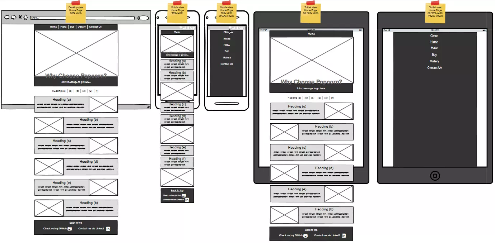
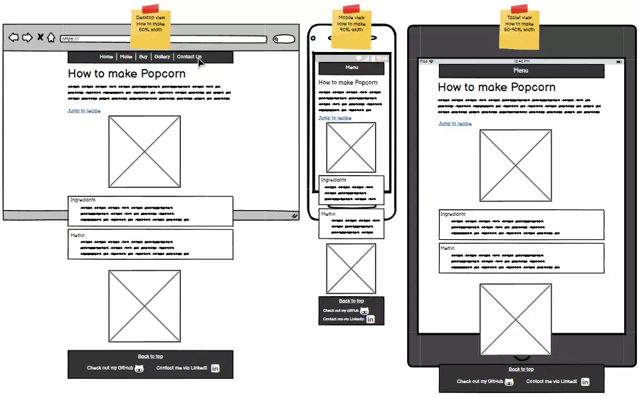
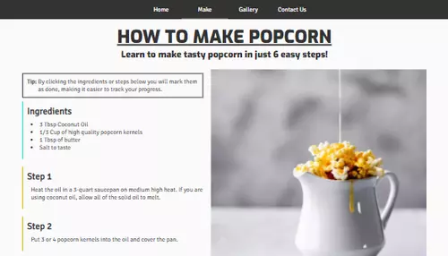
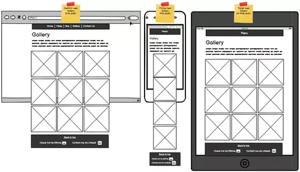
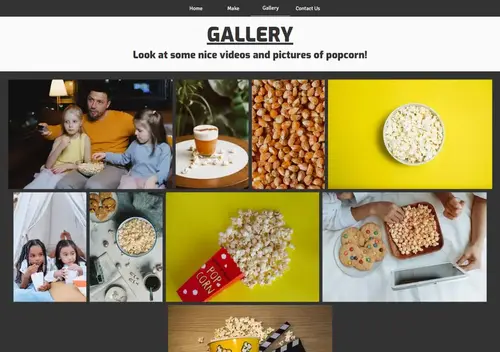
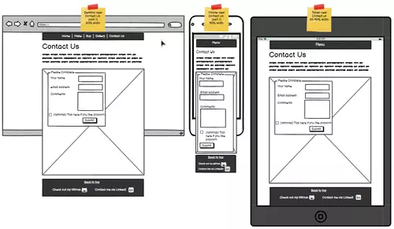
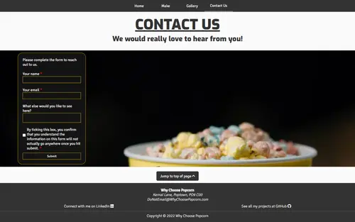
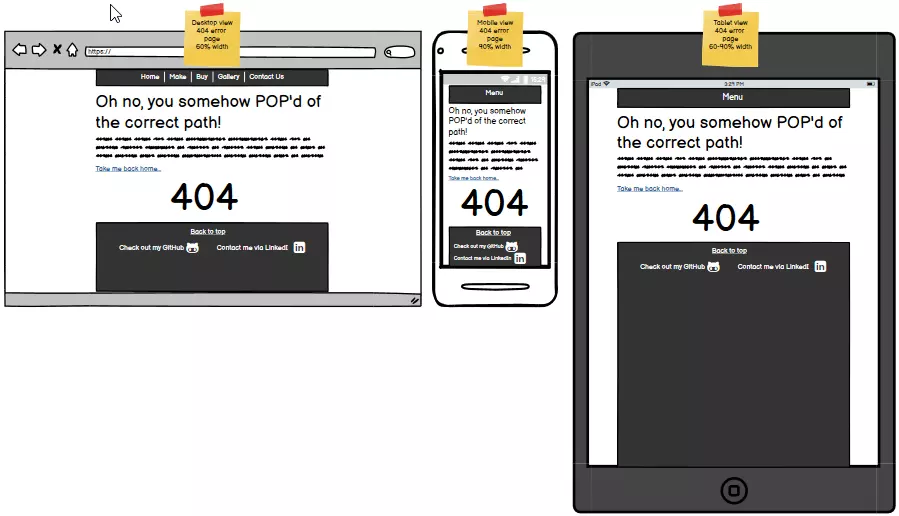
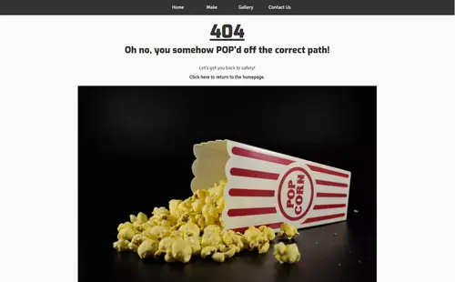

# **Wireframes and End Results**

## Introduction

As part of the initial planning stages I created wireframes using [Balsamiq](https://balsamiq.com/). These allowed me to hit the ground running with an initial design plan.

Throughout the production of creating the website on self-reflection and feedback from others I made design changes. Most of these changes were to accommodate a more aesthetically pleasing site, as well as making the site work better responsively.
***
## Overall design changes
- Originally I planned for PC to have a 60% width page container. But after feedback that there was too much white space on the sides. I redesigned the site to be 90% width on all devices. 
- This also meant I changed the width of the nav bar, header bar, and footer to be 100% width of the page.
***
## Homepage (index.html)
[Homepage - index.html](https://bobwritescode.github.io/ci-Project1/index.html)\

- Change of design to the sections under the header on PC to be paired, and on ultra-wide screens they would triple for each row.
***
## How To Make Popcorn (make.html)
[How To Make Popcorn - make.html](https://bobwritescode.github.io/ci-Project1/make.html)\
\

- A change made for PC to eliminate unused white space was to move the image on PC to the right of the ingredients and instructions.
***
## Gallery (gallery.html)
[Gallery - gallery.html](https://bobwritescode.github.io/ci-Project1/gallery.html)\
\

- A change made for all devices was to move away from the proposed grid format and to a more fluid design using flex.
- I also added a charcoal background color for the images.
***
## Contact Us (contact.html)
[Contact Us - contact.html](https://bobwritescode.github.io/ci-Project1/contact.html)\

- One change I made on this page was to streach the background image the whole page width.
***
## 404 (404.html)
[404 - 404.html](https://bobwritescode.github.io/ci-Project1/404.html)\
\

- Moved the 404 to the main heading of the page.
- Added an image on to the page.